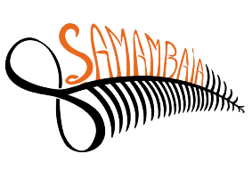

  

# 🌿 BaqueMix - Roda de Samambaia

Une application web interactive conçue pour arranger, visualiser et diriger les morceaux de Maracatu. Pensée pour les besoins du maracatu **Samambaia**, elle permet d'éditer les lignes de percussions traditionnelles et de gérer facilement la répartition des chants.

🌍 **Accéder à l'application :** [Lancer l'interface](https://julianbzh-coder.github.io/roda-samambaia/)

## ✨ Fonctionnalités principales

- **Misturador (Table de mixage) 🎛️** : Ajustez le tempo (BPM), la métrique (Compassos en 2/4, 3/4, 4/4, 6/8, 12/8) et le volume global de l'arrangement.
- **Éditeur d'instruments 🥁** : Programmez visuellement les frappes pour chaque instrument du baque (Alfaia, Caixa, Gonguê, Agbê, Mineiro).
- **Gestionnaire de Voix 🎤** : Assignez et distinguez visuellement les parties vocales (Puxador en bleu foncé / Coro en bleu clair).
- **Extraction des paroles 📝** : Générez et exportez automatiquement les paroles (Letras) à partir de la timeline.
- **Sauvegarde et Navigation 💾** : Enregistrez vos arrangements et naviguez entre vos différents morceaux.

## 🚀 Comment l'utiliser ?

L'éditeur utilise un système de frappe au clavier intuitif pour programmer les rythmes :

**Règle d'or de la dynamique :**
- **Majuscule** = Coup fort / accentué
- **Minuscule** = Coup faible / note fantôme

**Raccourcis par instrument :**
- **Alfaia & Caixa :** `D`/`d` (Main droite), `G`/`g` (Main gauche)
- **Gonguê :** `G`/`g` (Grave), `A`/`a` (Aigu)
- **Agbê :** `G`/`g` (Gauche), `D`/`d` (Droite)
- **Mineiro :** `P`/`p` (Haut), `T`/`t` (Bas)

**Navigation :**
- Appuyez sur **Espace** pour avancer dans la mesure ou laisser un silence.
- Utilisez les **Flèches directionnelles (←/→)** pour vous déplacer dans la grille rythmique.

## 🛠️ Stack Technique
- HTML / CSS / JavaScript (Vanilla)
- Hébergé via GitHub Pages

## 📬 Contact
Pour toute question, suggestion ou contribution au projet : 
julian.bzh@gmail.com
